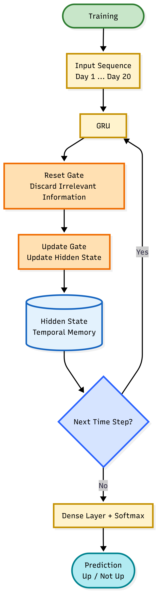
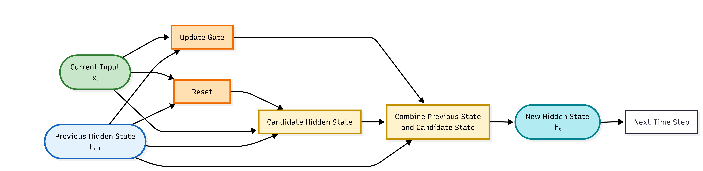

# GRU (Gated Recurrent Unit)
rede neural recorrente (RNN)

- DNN recebe todas as entradas de uma vez. Já o GRU recebe na ordem em que ocorrem

# O que faz
basicamente aprende "o que vale a pena lembrar e o que pode ser esquecido?"
faz isso usando portas (gates) - são apenas duas

# Reset Gate
decide "a informação antiga ainda é importante?" se não, ela praticamente ignora

# Update Gate
ela decide "guardo o conhecimento antigo ou atualizo?"

# Fluxo

# Hidden State
memória da rede
 

# Matemática
para cada dia ele calcula: 

reset gate: 
    $$
    r = \sigma(W_r \cdot [h_{t-1}, x_t])
    $$

update gate:
    $$
    z = \sigma(W_z \cdot [h_{t-1}, x_t])
    $$

novo estado candidato:
    $$
    \tilde{h}_t = \tanh(W_h \cdot [r \ast h_{t-1}, x_t])
    $$

mistura final:
    $$
    h_t = (1 - z) \ast h_{t-1} + z \ast \tilde{h}_t
    $$

# Por que é melhor que lstm
lstm possui forget gate, input gate, output gate, cell state. são quatro mecanismos
a gru junta tudo em apenas dois
menos parâmetros, mais rápida e menos memória

# Hiperparâmetros
1. units=32
    tamanho da memoria;
    mais unidades -> mais capacidade -> mais risco de overfitting
2. activation
    ativação interna;
    quase sempre tanh
3. recurrent_activation
    sigmoide, é usada nas portas, nunca muda
4. dropout=0.2
    desliga os neurônios durante o treinamento -> reduz o overfitting
5. return_sequences=False
6. optimizer
7. learning_rate
8. batch_size
9. epochs
10. earlystopping

# Vantangens
- aprende tendências
- entende sequência
- usa memória
- menos parâmetros que lstm
- rápida

# Desvantagens
- mais lenta que DNN
- precisa de mais dados
- mais difícil de interpretar 
- mais custo computacional 

