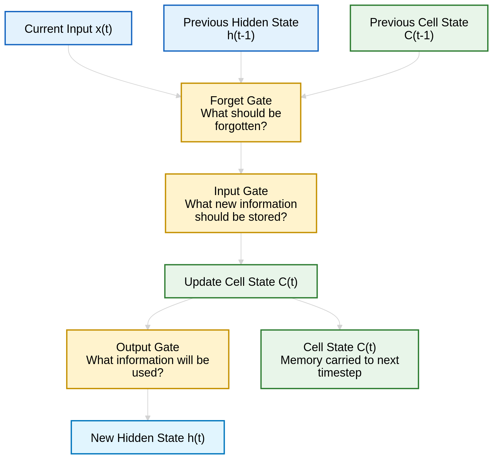
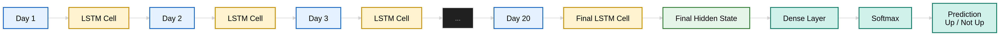
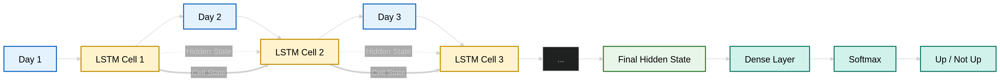

# LSTM
rede neural recorrente criada para aprender dependências ao longo do tempo
ele recebe uma sequência inteira

# Estrutura
## Funcionamento interno de uma única célula

## Fluxo completo da LSTM

## Memória sendo passada

# Portas LSTM
1. forget date
    "o que devo esquecer?"
2. input gate
    "o que devo aprender agora?"
3. output gate
    "o que devo usar para prever?"

# Hiperparâmetros
os mesmos do gru
